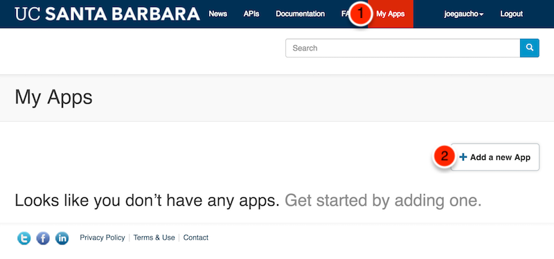
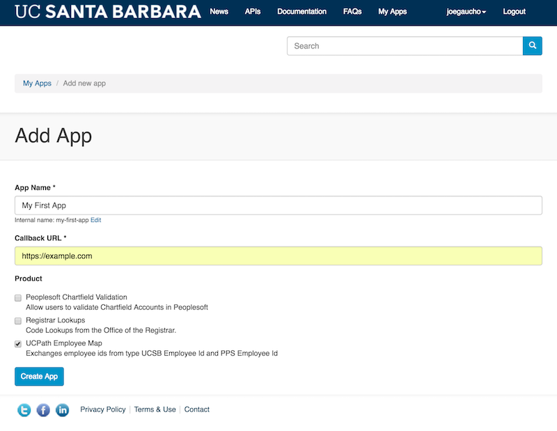
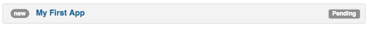
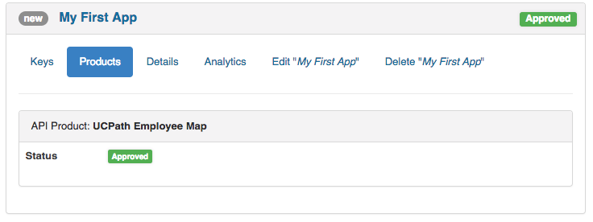
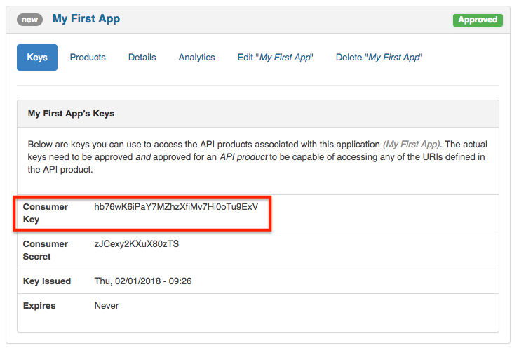

Creating your first app is easy.  From the top navigation menu, click on **My Apps**, then click on the **Add a new App** button.

The portal then displays the default app registration form:

Give your app a name, like **My First App** and a temporary callback URL like https://example.com.  (*TODO: I dont think we need to establish a callback URL here because it is really dependent on the API product they are choosing.  Can someone confirm this?*)

Next, choose which API **Product** you want to use in your App.  You may choose more than one **Product** if it makes sense to do so for your application.

A **Product** is a collection of related APIs that are bundled together. (TODO: reference to data glossary here)

After your app is creating, your app will appear in a pending status:

*Note: Depending on the API Product you have selected in your app and the app's data protection level, certain API Products will automatically be approved without oversight.  Otherwise, most API Products will typically be approved on a case-by-case scenario.*

Once your individual API Products are approved, they will begin to appear as **Approved**.

Inside of your **My First App**, take notice of your **Consumer Key** in the **Keys** tab of your app.  The **Consumer Key** is your API key which need to be passed into each of your selected API Products in order to be granted access to that API.

[Trying out your API ➡](trying-out-apis)
