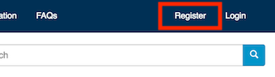
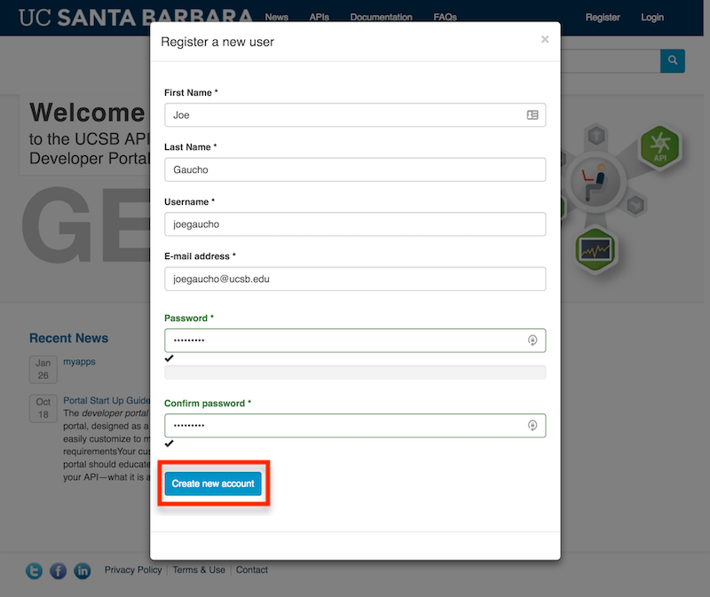
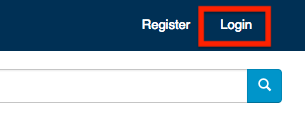
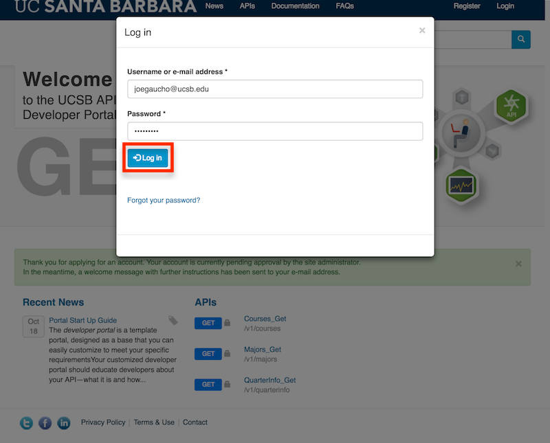
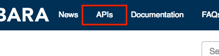

**Warning**: The following documentation is a work in progress and is evolving rapidly.

# Overview
* [First Steps](#first-steps)
* [Signing in](#signing-in)

## First steps

To get started, you first need to register as a new user.  Click on the **Register** link in the upper right navigation bar to sign up:

If you are a developer as part of a larger campus organization, we encourage you to register using a functional account so that you would benefit from an account that is not tied to a specific individual.  Having a functional account helps with future management of the account as well as supporting business continuity requirements.

Alternatively, if you are an individual developer, you can register an account using your email address:

Once an account is created, you will get an email confirming that your account has been created and is awaiting approval.

*Note: As of this writing, an administrator will review your account and will grant new accounts manually, but our plan in the future is to have the system automatically approve new accounts.*

## Signing in

To check the status of your account approval, click on the **Login** link in the upper right navigation bar:

Proceed with using the account **username** and **password** that you used during the registration process:

*Note: If your account has not yet been approved, you will get a message saying:*
**The username {joegaucho} has not been activated or is blocked.**  If you do get this message, your account is still awaiting approval.

Once your account is approved and you have logged in, browse the list of APIs available by visiting the APIs link in the top navigation to get a sense of what type of APIs are available and the requirements to use them.

[Creating Your First App ➡](creating-your-first-app)
