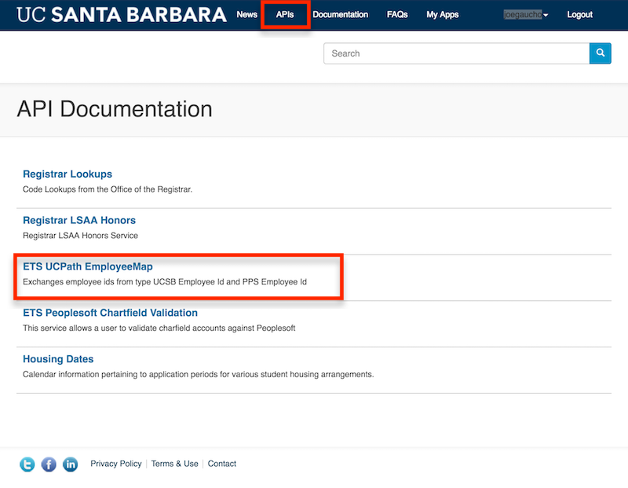
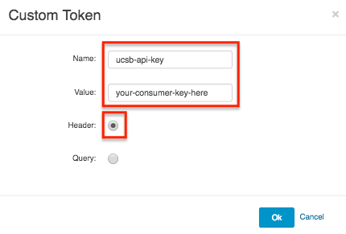
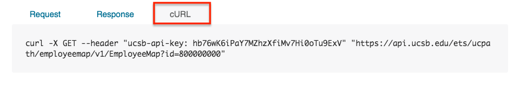

To use an API, you must pass in a required [HTTP Header](https://en.wikipedia.org/wiki/List_of_HTTP_header_fields) of `ucsb-api-key` to that API Resource URL.

As an example, let's take a look at how to use the UCPath Employee Mapping service API.  Click on the **APIs** link in the top navigation menu, then click on **ETS UCpath EmployeeMap**.



There is only one API, **EmployeeMap-get**.  Click on that to view its documentation:


Review the **EmployeeMap-get** documentation.  It requires that we pass in an **id** in the request as a query parameter.  Note that different APIs will have different **Query Parameters** or even other Path and Header Parameters depending on their unique requirements, but all APIs *will* require the `ucsb-api-key` HTTP Header.

Lets establish our **API Key** now by clicking on the **Api Key** button:


We want to enter in `ucsb-api-key` as the name and we want to insert our **Consumer Key** from our **My First App** page as our value.  Make sure the **Header** radio button is checked and then click **Ok**.



Next, fill in the **id** value as required by the UCPath EmployeeMap-Get API documentation.  Finally, let's click on **Send this request** to perform the network request.  If all went well, you should see a response like this:

```
[
  {
    "InputId": "800000000",
    "OutputId": "60000000",
    "errorMsg": {
      "Success": true,
      "Message": "Match found for this ID"
    }
  }
]
```

For completeness, you can click on the **cURL** tab to see how this portal is sending the request to this **Resource URL** API endpoint:



*Note: If your API key is invalid or if you've entered it incorrectly, you'll see an error like this:*
```
{
  "fault": {
    "faultstring": "Invalid ApiKey",
    "detail": {
      "errorcode": "oauth.v2.InvalidApiKey"
    }
  }
}
```

Congratulations!  You have just completed your first API call.
